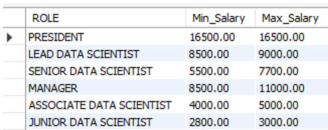
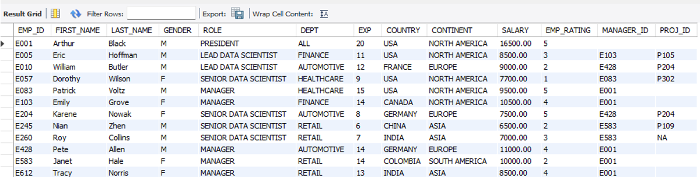
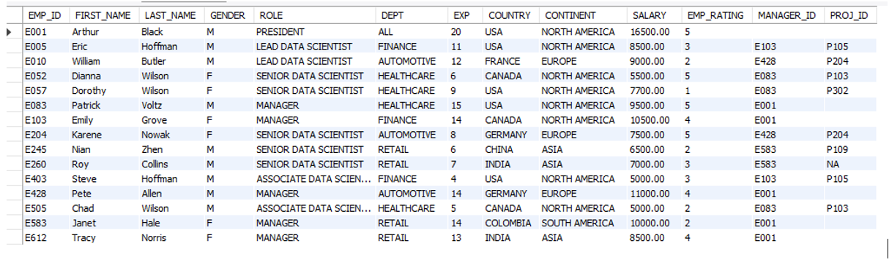

# 🧩 Employee Performance Mapping — SQL Capstone Project

### 📊 Overview  
This project analyzes and maps **employee performance across multiple projects** using **MySQL**.  
It demonstrates practical SQL proficiency in **database creation, data import, joins, aggregations, views, stored procedures, and functions**, following the 17 structured Actions from the Simplilearn Capstone series.

---

### 🎯 Objectives  
- Design and manage relational tables for employees, projects, and data science teams  
- Perform SQL-based analysis to identify performance patterns, salaries, and project outcomes  
- Build stored procedures and functions for modular analytics  
- Generate management-level reports through SQL views  

---

### ⚙️ Tools Used  
- **MySQL 8.0 (Workbench)**  
- CSV dataset imports  
- SQL Joins, Aggregates, Views, Stored Procedures, and Functions  

---

### 🧮 Datasets  
| File | Description |
|------|--------------|
| `emp_record_table.csv` | Employee details — role, join date, salary, rating, etc. |
| `proj_table.csv` | Project information — budget, delivery status, start/end dates. |
| `data_science_team.csv` | Team structure — competency, role level, bonus eligibility. |

*All datasets are course-provided (Simplilearn) and used solely for educational and demonstration purposes.*

---

### 🧭 Process (Summary of Actions)  
- **Action 1–3:** Database & table creation  
- **Action 4–5:** Data import & validation  
- **Action 6–10:** Queries for employee and project performance mapping  
- **Action 11:** SQL view creation for high-salary employees  
- **Action 13:** Stored procedure for experienced employee retrieval  
- **Action 14–15:** Stored functions for role mapping  
- **Action 16–17:** Query optimization & indexing  

---

### 📈 Results & Outputs  

The following outputs summarize the analytical results executed in **MySQL Workbench**, demonstrating the practical implementation of each SQL component.

---

#### ✅ **Action 9 — Salary Range by Role**  
**Query:** Calculate the *minimum and maximum salary* of employees in each role.  
**Result:** Highlights salary distribution across various job designations.

   
  <em>Figure 1: SQL query output showing minimum and maximum salary by role.</em>

---

#### ✅ **Action 11 — High Salary Employees View**  
**Query:** Create a view to display employees whose salaries exceed 6000.  
**Result:** Demonstrates the creation of a reusable SQL view for management to track top earners and potential bonus candidates.

   
  <em>Figure 2: SQL view displaying employees with salary above 6000 across all roles.</em>

---

#### ✅ **Action 13 — Stored Procedure**  
**Procedure:** `CALL Get_Experienced_Employees();`  
**Result:** Retrieves all employees whose experience exceeds **three years**, demonstrating the stored procedure’s filtering logic.

   
  <em>Figure 3: Stored procedure output listing employees with more than three years of experience.</em>

---

💡 *All results were generated using course-provided datasets and executed in MySQL 8.0 as part of the Employee Performance Mapping Capstone Project.*

---

### 📂 Repository Structure  

---

Employee-Performance-Mapping/
├── data/
│ ├── emp_record_table.csv
│ ├── proj_table.csv
│ └── data_science_team.csv
├── scripts/
│ └── employee_performance_mapping.sql
├── reports/
│ └── Employee_Performance_Mapping_Report.pdf
├── assets/
│ ├── query-results.png
│ ├── high-salary-view.png
│ └── procedure-output.png
└── README.md

---
